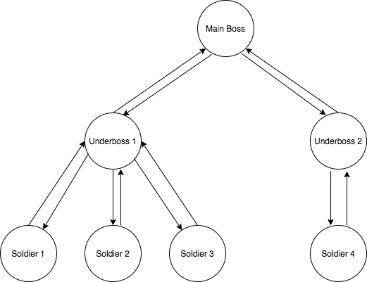

# Overview

McMafia is an HTTP service for registering data related with criminal organizations and provides an interface for performing several common operations that are available for manipulating the structure of an organization.

## Getting started

The most simple way of starting the application is by running one single command: `make start` (=docker-compose up, **you must have docker installed**), that will spin up three services in your host:

* McMafia, http://localhost:3000
* mongodb, mongodb://localhost:27017
* mongo ui, http://localhost:8081

`make install && make test` for running unit and functional tests

The service start up configuration can be modified by using the following env vars:

* MCMAFIA_PORT, change application port
* MCMAFIA_MONGO_URI, mongo url
* MCMAFIA_DATABASE, database name

## HTTP endpoints

### Data Routes

`seeds` directory contains a valid payload for POST /members that will allow to start to work with some initial data.

#### GET /members/{id?}

| request params  | required      | type   | description                                                        |
|-----------------|:-------------:|:------:|:-------------------------------------------------------------------|
| id              |  no           | string | get single member by id, when no id is provide returns all members |

| query params    | required      | type   | description                                                             |
|-----------------|:-------------:|:------:|:------------------------------------------------------------------------|
| organization    |  no           | string | filter the list of members by the organization to which they belong to  |

Examples:
```
curl -X GET \
  http://localhost:3000/members/f653e12680054da7981684a23900632a
```
```
curl -X GET \
  http://localhost:3000/members
```
```
curl -X GET \
  http://localhost:3000/members?organization=camorra
```

#### POST /members

| payload                 | required     | type   | description                                         |
|-------------------------|:------------:|:------:|:----------------------------------------------------|
| { "members": [...] }    |  yes         | json   | create/update the list of members passed by payload |

Example:

```
curl -X POST \
  http://localhost:3000/members \
  -H 'Content-Type: application/json' \
  -d '{
  "members": [
    {
      "id": "f653e12680054da7981684a23900632a",
      "name": "Pablo",
      "surname": "Escobar",
      "organization": "Cartel de Medellin",
      "startedAt": "1985-05-05T14:48:00.000Z",
      "jail": false,
      "children": [
        "c48ac60af8184d4f898230f41b77584e",
        "03061d6e58bc4c5dba66347885d3edd9",
        "476fc73d2d844b6faa010e73b32d4ca4"
      ],
      "parent": null
    }
  ]
}'
```

### Business Routes

#### GET /subordinates/{id}

| request params  | required      | type   | description                                                   |
|-----------------|:-------------:|:------:|:--------------------------------------------------------------|
| id              |  yes          | string | return the number of subordinates of a given member by its id |

Example:

```
curl -X GET \
  http://localhost:3000/subordinates/f653e12680054da7981684a23900632a
```

#### POST /imprision

| payload              | required      | type   | description                                                                                   |
|----------------------|:-------------:|:------:|:----------------------------------------------------------------------------------------------|
| { "id": "memberId" } |  yes          | json   | when succes return the resulting organization structure after imprisioning a member by its id |

Example:

```
curl -X POST \
  http://localhost:3000/imprision \
  -H 'Content-Type: application/json' \
  -d '{
	"id": "03061d6e58bc4c5dba66347885d3edd9"
}'
```

#### POST /release

| payload              | required      | type   | description                                                                                |
|----------------------|:-------------:|:------:|:-------------------------------------------------------------------------------------------|
| { "id": "memberId" } |  yes          | json   | when succes return the resulting organization structure after releasing a member by its id |

Example:

```
curl -X POST \
  http://localhost:3000/release \
  -H 'Content-Type: application/json' \
  -d '{
	"id": "03061d6e58bc4c5dba66347885d3edd9"
}'
```

#### GET /rank/{ids}

| request params            | required      | type   | description                                                                                                                                                 |
|---------------------------|:-------------:|:------:|:------------------------------------------------------------------------------------------------------------------------------------------------------------|
| ids (comma separated ids) |  yes          | string | return who ranks better in the organization in base on how close they are to the main boss, in the event of a tie the number of subordinates are considered |

Example:

```
curl -X GET \
  'http://localhost:3000/rank/f653e12680054da7981684a23900632a,03061d6e58bc4c5dba66347885d3edd9'
```

## Project structure

```
.
|____test
| |____unit
| |____functional
|____config
|____Dockerfile
|____Makefile
|____service.js
|____server
| |____app
| | |____dao
| | |____model
| | | |____Organization.js
| | | |____Node.js
| |____index.js
| |____routes
| | |____business
| | | |____index.js
| | |____index.js
| | |____members
| | | |____index.js
| | | |____schema.js
|____README.md
|____.Dockerignore
|____.gitignore
|____package-lock.json
|____package.json
|____seeds
| |____members_children.json
|____docker-compose.yml
```

* test > unit (unit testing)
* test > functional (functional testing)
* server > app > model (application model)
* server > app > dao   (data access object)
* server > routes > business (business http endpoints)
* server > routes > members (data http endpoints)

## Data modeling

There are two entities, Members and Organization. Members have two type of relationships, parent relationship with its direct ancestor for representing who is its direct boss and children relationship for representing its direct subordinates. Organization is an entity for representing a group of members related all together, for optimizing operations over the entire organization like imprisioning or releasing members the data is modeled by a generic tree data structure. E.g:



At the time of persisting data the organization tree is flattened in a structure of collections by following mongodb best practices:
* https://docs.mongodb.com/manual/tutorial/model-tree-structures-with-parent-references/
* https://docs.mongodb.com/manual/tutorial/model-tree-structures-with-child-references/

Example of one single member stored in mongodb
```
{
  "id": "c48ac60af8184d4f898230f41b77584e",
  "name": "Gonzalo",
  "surname": "Rodríguez Gacha",
  "organization": "Cartel de Medellin",
  "startedAt": "1985-06-05T14:48:00.000Z",
  "jail": false,
  "children": [
    "588975829e084764b66046b0ee7c814e",
    "2704f4f46c034eec869443d63250cb18"
  ],
  "parent": "f653e12680054da7981684a23900632a"
}
```

## Persistence

Data is persisted in mongodb, every time there is request that changes the organization structure like imprisoning or releasing members, the entire organization is updated to reflect the new updated structure.

## TODO

* Fix several inconsistencies (how to access private data in classes, new Class Member that inherits from Node to look for a better separation of concepts)
* Add UPDATE, DELETE CRUD operations
* Increase test coverage up to 100%
* Errors mapping
* Validation
* linting